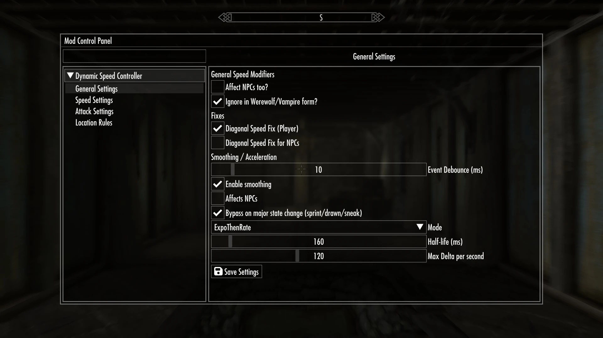
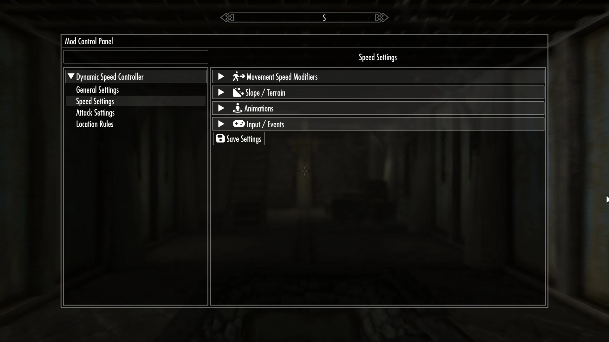
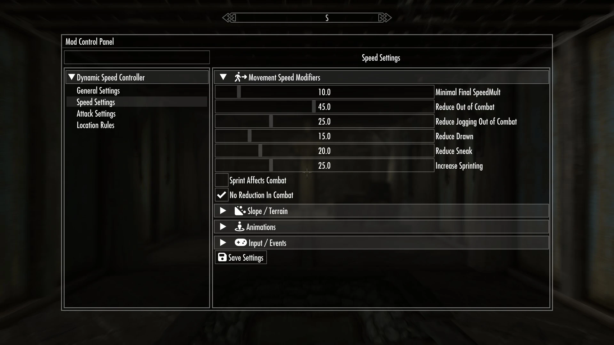
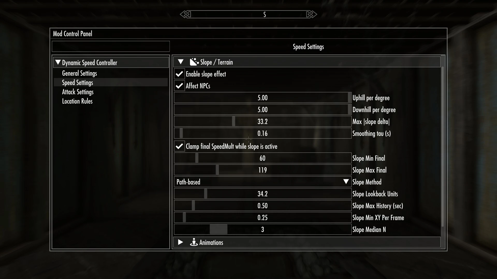
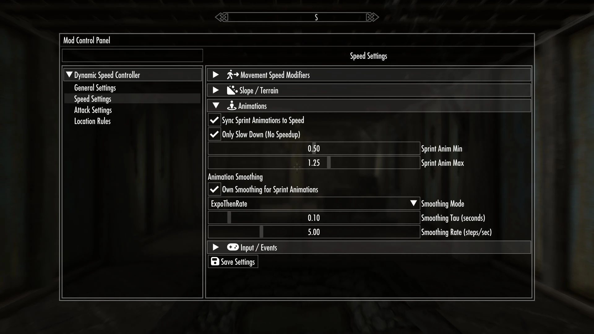
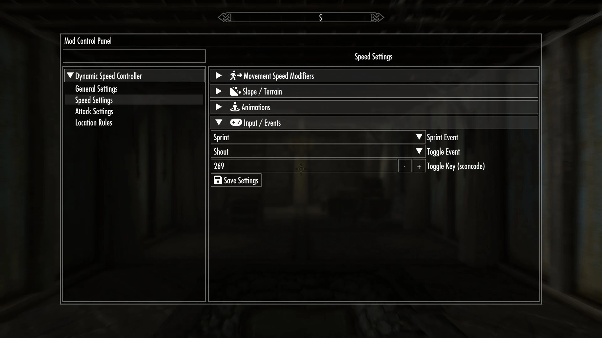
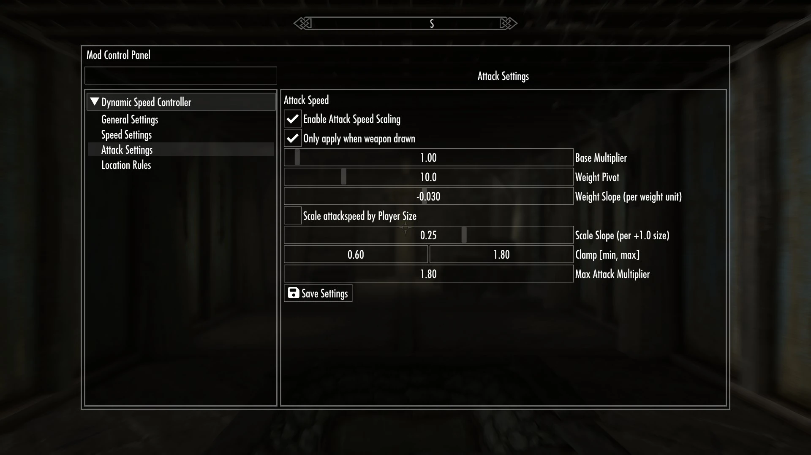
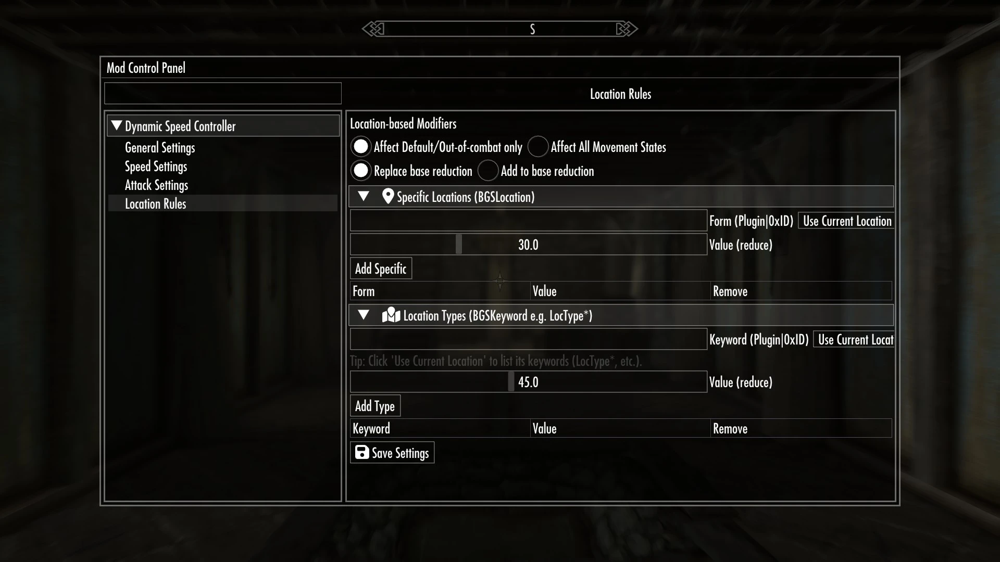

# Dynamic Speed Controller

> [](https://github.com/DanjelPiDev/TES5-DynamicSpeedController/releases/latest)

A lightweight SKSE plugin that adjusts your **SpeedMult** and **attack speed** based on your current state (drawn, sneak, jog, sprint, combat). It includes optional NPC support, weapon-weight and actor-size based attack scaling, a diagonal movement fix, sprint animation sync, and smooth acceleration options.  
No ESP and no scripts in your save; it is just a DLL with a JSON config. Optional in-game configuration via an SKSE menu.

> Tested on current AE on my setup. For the cleanest experience, save in the pause menu before changing settings.

---

## Table of Contents

- [Why](#why)
- [Features](#features)
- [Requirements](#requirements)
- [Installation](#installation)
- [Updating](#updating)
- [In-Game Configuration](#in-game-configuration)
- [Screenshots](#screenshots)
- [JSON Configuration](#json-configuration)
  - [Key Explanations](#key-explanations)
- [Tips](#tips)
- [Troubleshooting](#troubleshooting)
- [Uninstall](#uninstall)
- [Build From Source](#build-from-source)
- [Roadmap](#roadmap)

---

## Why

Skyrim combines forward and sideways input in a way that makes diagonal movement faster than intended. This plugin reads the movement axes from the animation graph and applies a minimal, state-aware correction that preserves your configured minimum speed. The correction can be lighter while sprinting and can be enabled for NPCs.

---

## Features

- **Per-state movement tuning** for Default, Jogging, Drawn, Sneak, and Sprint. You can decide that combat keeps full speed.
- **Optional NPC support** for movement, diagonal fix, smoothing, and attack scaling.
- **Attack speed scaling** by weapon weight and actor size with base multiplier, pivot, slope, and clamps; optionally only when drawn.
- **Diagonal speed fix** that respects your minimum SpeedMult and can apply to NPCs.
- **Smooth acceleration** with Expo, Rate Limit, or Expo-then-Rate, plus a bypass on major state changes.
- **Sprint animation sync** that matches animation rate to your current SpeedMult with its own smoothing and clamps.
- **Jogging toggle** via hotkey or user event name (defaults: Toggle = `Shout`, Sprint latch = `Sprint`).
- **Location rules** for specific locations or location types, with replace or add behavior and a choice to affect default only or all states.
- **Safety floor** so SpeedMult never drops below your minimum.
- **Beast form awareness** to ignore modifiers in Werewolf or Vampire Lord forms if desired.
- **Lightweight and script-free**; no Papyrus, no save bloat.

---

## Requirements

- **SKSE** for Skyrim SE/AE
- **Optional:** SKSE Menu Framework (for the in-game menu pages: General, Speed, Attack, Location Rules)

---

## Installation

1. Drop the DLL and `SpeedController.json` into `Data\SKSE\Plugins\`.
2. Start the game; settings are auto-loaded.

---

## Updating

1. Back up your current `SpeedController.json` if you want to keep your values.
2. Replace the DLL and `SpeedController.json` in `Data\SKSE\Plugins\`.
3. Start the game; settings auto-load. The plugin restores a safe baseline after load.

---

## In-Game Configuration

If the SKSE menu is present, open the Mod Control Panel and select **Dynamic Speed Controller**. Pages:

**General**
- Toggle NPC scaling, beast-form ignore, diagonal fix (player and NPCs).
- Event debounce settings.
- Smoothing enable, mode, half-life, max change per second, and bypass on major state changes.
- Save settings to JSON.

**Speed**
- Reductions for Default, Jogging, Drawn, Sneak, and an extra increase for Sprint.
- Option for sprint bonus to also apply during combat.
- Minimum final SpeedMult clamp.
- Sprint animation sync to movement speed with dedicated smoothing and clamps.
- Bind a toggle user event or a scancode; set the sprint event name.

**Attack**
- Enable attack speed scaling and optionally restrict it to when weapons are drawn.
- Base multiplier, weight pivot and slope.
- Optional actor scale with own slope.
- Min and max clamps. Updates on equip.

**Location Rules**
- Choose whether rules affect Default only or all states.
- Replace or Add behavior.
- Add specific locations by `Plugin|0xFormID`, or press **Use Current Location**.
- Add location types by keyword (e.g., `LocTypeCity`).
- Inline edit, remove entries, and save the list.

---

## Screenshots

<div align="center">
	
	
	
	
	
	
	
	
</div>

---

## JSON Configuration

Everything lives in `Data/SKSE/Plugins/SpeedController.json`. The in-game menu reads and writes the same file.

```json
{
  "kReduceOutOfCombat": 45.0,
  "kReduceJoggingOutOfCombat": 25.0,
  "kReduceDrawn": 15.0,
  "kReduceSneak": 20.0,
  "kIncreaseSprinting": 25.0,
  "kNoReductionInCombat": true,

  "kToggleSpeedKey": 269,
  "kToggleSpeedEvent": "Shout",
  "kSprintEventName": "Sprint",

  "kEnableSpeedScalingForNPCs": false,
  "kEnableDiagonalSpeedFix": true,
  "kEnableDiagonalSpeedFixForNPCs": false,
  "kIgnoreBeastForms": true,

  "kSmoothingEnabled": true,
  "kSmoothingAffectsNPCs": true,
  "kSmoothingBypassOnStateChange": true,
  "kSmoothingMode": "ExpoThenRate",
  "kSmoothingHalfLifeMs": 160.0,
  "kSmoothingMaxChangePerSecond": 120.0,

  "kMinFinalSpeedMult": 10.0,
  "kEventDebounceMs": 10,

  "kSyncSprintAnimToSpeed": true,
  "kOnlySlowDown": true,
  "kSprintAnimMin": 0.50,
  "kSprintAnimMax": 1.25,
  "kSprintAnimOwnSmoothing": true,
  "kSprintAnimMode": 2,
  "kSprintAnimTau": 0.10,
  "kSprintAnimRatePerSec": 5.0,
  "kSprintAffectsCombat": false,

  "kAttackSpeedEnabled": true,
  "kAttackOnlyWhenDrawn": true,
  "kAttackBase": 1.0,
  "kWeightPivot": 10.0,
  "kWeightSlope": -0.03,
  "kUsePlayerScale": false,
  "kScaleSlope": 0.25,
  "kMinAttackMult": 0.60,
  "kMaxAttackMult": 1.80,

  "kReduceInLocationSpecific": [],
  "kReduceInLocationType": [],
  "kLocationAffects": "default",
  "kLocationMode": "replace"
}
```

### Key Explanations
- kReduceOutOfCombat, kReduceJoggingOutOfCombat, kReduceDrawn, kReduceSneak
Reductions per state. Jogging is a toggle variant of Default.

- kIncreaseSprinting
  - Extra increase while sprinting. If kSprintAffectsCombat is true, this bonus also applies in combat.

- kNoReductionInCombat
  - When true, combat keeps full base speed.

- kMinFinalSpeedMult
  - Safety floor for the final SpeedMult.

- kEnableDiagonalSpeedFix, kEnableDiagonalSpeedFixForNPCs
  - Removes the diagonal advantage, respects kMinFinalSpeedMult, uses a gentler penalty during sprint.

- Smoothing
  - kSmoothingEnabled, kSmoothingMode (Expo, Rate, ExpoThenRate), kSmoothingHalfLifeMs, kSmoothingMaxChangePerSecond, and kSmoothingBypassOnStateChange control how quickly current deltas approach targets, with optional bypass on state changes like draw, sneak, sprint.

- Sprint animation sync
  - kSyncSprintAnimToSpeed, kOnlySlowDown, kSprintAnimMin, kSprintAnimMax, kSprintAnimOwnSmoothing, kSprintAnimMode, kSprintAnimTau, kSprintAnimRatePerSec.

- Attack scaling
  - kAttackSpeedEnabled, kAttackOnlyWhenDrawn, kAttackBase, kWeightPivot, kWeightSlope, kUsePlayerScale, kScaleSlope, kMinAttackMult, kMaxAttackMult govern weapon-weight and actor-scale based attack speed. Updates on equip.

- Input bindings
  - kToggleSpeedEvent, kToggleSpeedKey, kSprintEventName drive jogging and sprint detection via game user events or a scancode.

- Location rules
  - kReduceInLocationSpecific and kReduceInLocationType define rules per location or keyword.
kLocationAffects: "default" or "all".
kLocationMode: "replace" or "add".

- Misc
  - kEnableSpeedScalingForNPCs applies scaling rules to NPCs.
kIgnoreBeastForms disables modifiers in Werewolf and Vampire Lord forms.
kEventDebounceMs reduces spam from rapid input changes.

## Tips
- When you change input bindings, listeners update immediately and the player gets a refresh.

- Controller thumbstick axes are filtered with a dead zone and feed the diagonal correction.

- The plugin nudges a harmless actor value to trigger Skyrim’s movement recompute, then compensates it so gameplay values stay intact. This avoids stuck movement after loads or rapid state changes.

## Troubleshooting
**Inventory weight looks off or movement feels stuck after a load**
The plugin restores a safe baseline and performs a refresh. If needed, open the menu and press Save Settings, or briefly toggle jogging to rewrite the current delta.

**Diagonal still feels weird**
Ensure the diagonal fix is enabled for the player. If your reductions are very strong, raise kMinFinalSpeedMult so the fix has headroom.

**Attack speed does not change**
Verify attack scaling is enabled and, if using “only when drawn”, that your weapon is drawn. Re-equip to force an update.

## Uninstall
Delete the DLL and the JSON. The plugin reverts its deltas and leaves no scripts in your save.

## Build From Source
- Clone the repository

- Configure with CMake for MSVC on Windows.

- Link against SKSE and CommonLibSSE/NG as appropriate for your target runtime.

- Build the release DLL and place it in Data\SKSE\Plugins\.

## Roadmap
[ ] Additional state hooks and alternate smoothing presets

[ ] Optional per-weapon overrides

[ ] More granular NPC filters
